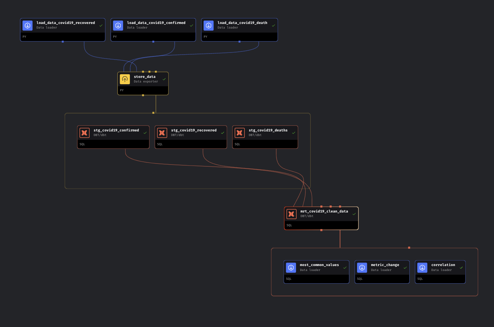
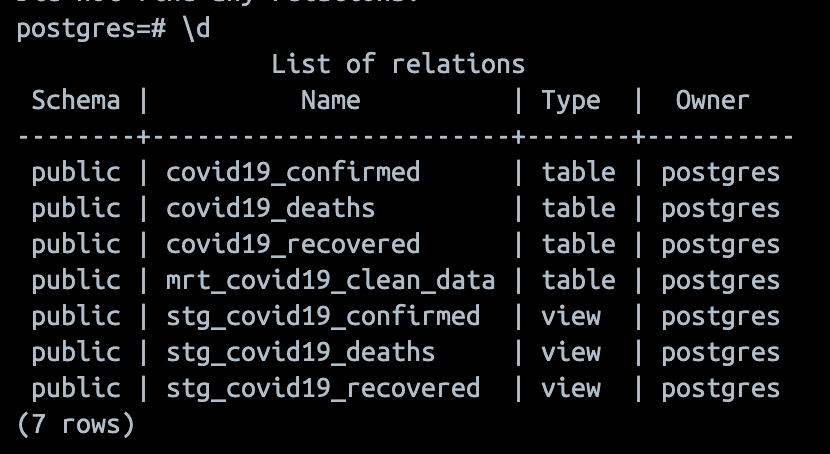

# Magez
Implement Mage.AI to Ingest, Transform, Store, Analysis Data Test


## COVID-19 Data Pipeline and Analysis

This project involves transforming COVID-19 data, storing it in a PostgreSQL database, and performing complex data analysis. Below are the steps to set up the environment, load data, transform it, and run the analysis.

## Dataset
Use [COVID-19 Data Repository by Johns Hopkins University.](https://github.com/CSSEGISandData/COVID-19/tree/master/archived_data/archived_time_series)

## Setup Instructions

### Prerequisites

- Docker
- Docker Compose

### Clone the Repository

Clone this repository to your local machine:

```sh
git clone https://github.com/jogjezz/Magez.git
cd Magez
```

### Run Docker Compose

Run the Docker containers using Docker Compose

```sh
docker-compose up
```

Open a browser and navigate to http://localhost:6789.

1. From the Pipelines page, select **dbt_demo**.

2. Open the notebook view by selecting **Edit pipeline** from the left-side navigation.

3. Select the first block by clicking it and run the block by selecting the **play** icon in the top-right corner.

You have now run your first Mage block and loaded data from a dataset!


### Pipeline Overview

The pipeline includes the following blocks:

 - **Load Data:** Ingest COVID-19 data from the source (confirmed, recovered, deaths).

 - **Store Data**: Save the data into a PostgreSQL database.

 - **Transform Data**: Use DBT for data cleaning and transformation.

 - **Analyze Data**: Perform SQL-based analysis.


Below is an example image of the pipeline:





Upon successfully running the pipelines, you will see the tables and views in PostgreSQL





### Example Analysis Queries

- Top 5 most common values in country_region:

```sql
SELECT country_region, COUNT(*) AS frequency
FROM mrt_covid19_clean_data
GROUP BY country_region
ORDER BY frequency DESC
LIMIT 5;
```

#### Metric change over time (confirmed cases): 
```sql

SELECT
    date,
    SUM(confirmed) AS total_confirmed
FROM
    mrt_covid19_clean_data
GROUP BY
    date
ORDER BY
    date;
```

#### Correlation between confirmed cases and deaths:
```sql

SELECT CORR(confirmed, deaths) AS correlation
FROM mrt_covid19_clean_data;
